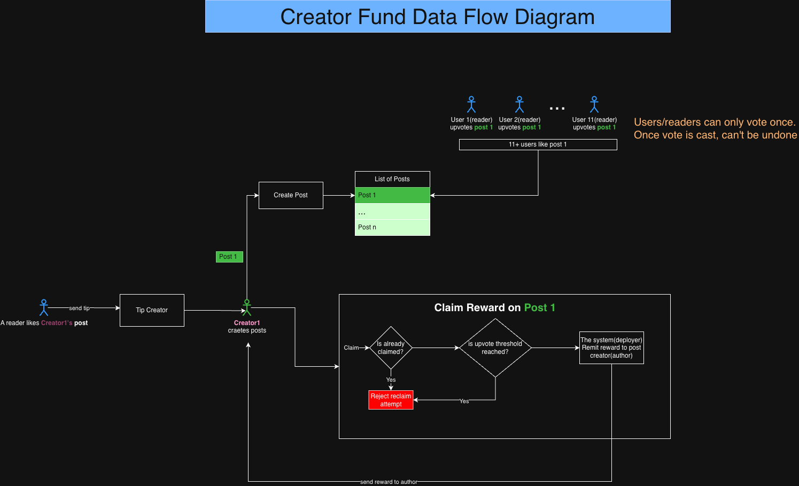

# Creator Fund

A Solana program that enables creators to earn rewards based on how much the community likes their posts. A creator is elibigle to claim rewards after getting likes beyond a certain set threshold.

**Features:**
- Creators can create posts with titles and content
- Community members can upvote or downvote posts
- Creators whose posts reach 10+ upvotes can claim SPL token rewards from a fund
- Users can directly tip creators with SPL tokens (creators must have at least 1 post)
- Prevents double voting and duplicate reward claims

This program incentivizes quality content creation through community voting and token-based rewards.

## User Stories

### As a creator, I can create posts with titles and content to share my work

**Acceptance Criteria:**
- Title must be provided and cannot be empty
- Title cannot exceed 100 characters
- Content must be provided and cannot be empty
- Content cannot exceed 280 characters

### As a user, I can upvote or downvote posts to show my engagement

**Acceptance Criteria:**
- User can only vote once per post; _after voting, votes can't be changed/recast_
- Vote increases the corresponding vote counter (up_votes or down_votes)

### As a user, I can tip creators with SPL tokens to support their content

**Acceptance Criteria:**
- Creator must have at least 1 post to receive tips
- Tipping user must have sufficient token balance
- Tokens are transferred from tipper's token account to creator's token account

### As a creator, I can claim SPL token rewards when my post exceeds a threshold upvotes

**Acceptance Criteria:**
- Post exceed threshold(10 in this case).
- Only the post author can claim the reward
- Reward can only be claimed once per post; _subsequent reclaims are rejected_
- Tokens are transferred from fund to creator's vault

## dApp Architecture



## Setup

1. **Clone the project**
```bash
git clone git@github.com:danielwangai/creator_fund.git
cd creator_fund
```

2. **Install dependencies**
```bash
yarn install
```

3. **Build the Anchor program**
```bash
make build
```

4. **Run tests**
```bash
make test
```


